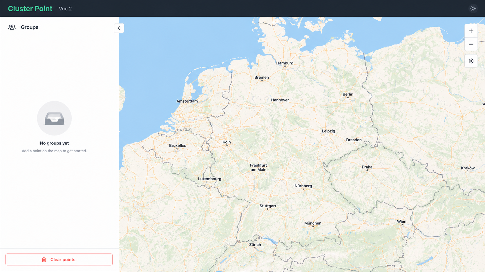
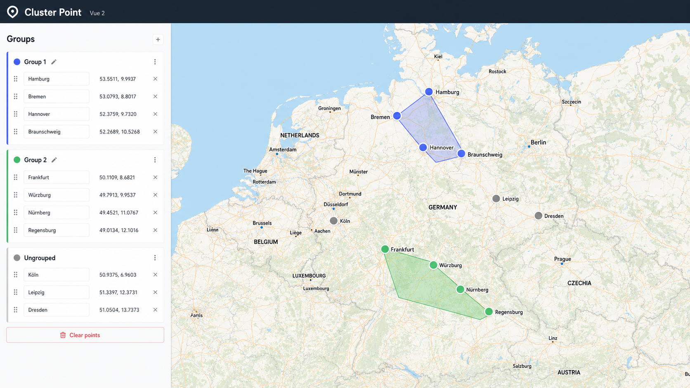

# Cluster Point

Cluster Point is a Vue 2 frontend implementation for exploring point clustering on an interactive map. Users can place points, inspect automatically generated groups, rename points, recolor cluster polygons, and clear the map back to an empty state.

The app is intentionally focused on the frontend experience: map interaction, sidebar state, cluster visualization, and responsive layout behavior.

## Screenshots





## Features

- Add points by clicking on the map.
- Automatically group nearby points after enough points are placed.
- Draw colored polygons around grouped points.
- Rename individual points from the sidebar.
- Recolor groups from the group heading.
- Track ungrouped points separately.
- Clear all points and reset the map.
- Toggle the sidebar on narrower viewports.

## Tech Stack

- Vue 2
- Vue CLI
- SCSS
- Google Maps JavaScript API
- Google Maps geometry library

## Requirements

- Node.js `14.18.0`
- npm
- A Google Maps API key with the Maps JavaScript API enabled

This project keeps its original Vue CLI and `node-sass` dependency stack, so use Node `14.18.0` for the most reliable install and build experience.

## Environment Setup

Create a local environment file from the example:

```bash
cp .env.example .env.development.local
```

Then add your Google Maps API key:

```bash
VUE_APP_GOOGLE_API_KEY=your_google_maps_api_key
```

For production builds, create a production local file the same way:

```bash
cp .env.example .env.production.local
```

## Installation

Use Node `14.18.0`, then install dependencies:

```bash
nvm use
npm install
```

## Development

Start the local development server:

```bash
npm run serve
```

The app will be served by Vue CLI, usually at `http://localhost:8080/`.

## Build

Create a production build:

```bash
npm run build
```

## Lint

Run the linter:

```bash
npm run lint
```

## Deployment

The project includes a GitHub Pages deployment script:

```bash
npm run deploy
```

A public live demo is not documented here because the deployed app requires a valid Google Maps API key. Once GitHub Pages is configured with a production key, the existing `homepage` value in `package.json` can be used as the live demo URL.

## Frontend Implementation Notes

The main layout combines a sidebar and a full-height map view. The map owns point creation, distance calculation, group construction, and polygon rendering. The sidebar listens for point and group updates, then presents editable point names, coordinates, group colors, and reset controls.

Point grouping starts after more than eight points exist. Distances are calculated with the Google Maps geometry library, and the grouping rule is derived from the maximum distance between placed points.
